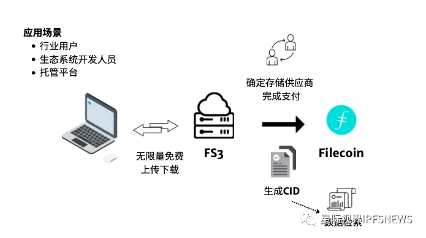
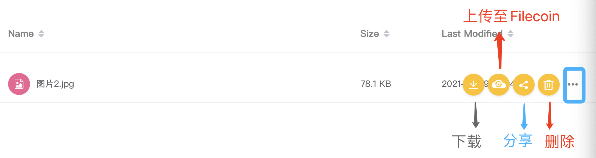
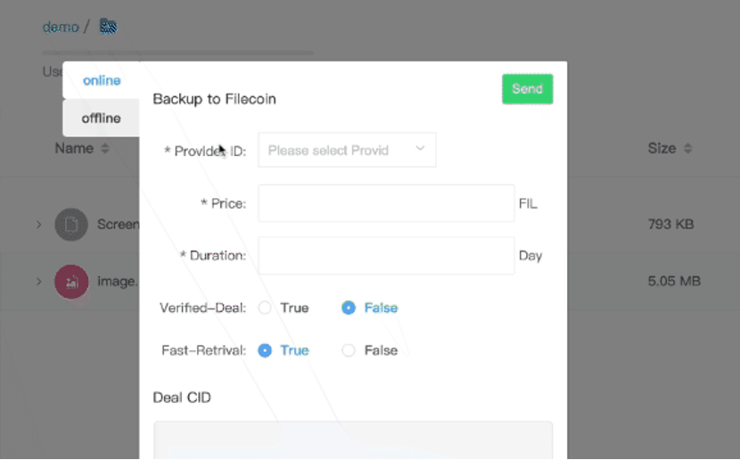

# FS3手册中文版

## FS3背景

今年以来，Web3.0、DeFi、NFT 和元宇宙的流行使得区块链生态快速发展，大量新兴项目也如雨后春笋，同时市场对于去中心化存储设施的需求也越来越高。Filecoin 作为目前区块链行业存储容量最大的去中心化存储设施也得到了关注，但是对于大部分应用开发者而言，主要问题在于原有亚马逊 S3、微软 Azure、谷歌等存储服务的迁移成本相对较高。另外应用开发者还需要对 Filecoin 存储功能进行二次开发，因此在一定程度上限制了 Filecoin 的应用场景。&#x20;

**FilSwan**作为Filecoin 生态的明星开发团队，开发了 **FS3** 存储功能来替代目前市场上的主流云存储服务产品，并且取得了很好的效果。FS3 通过集成 IPFS 和 Filecoin 的分布式存储网络，使得数据存储更加安全、快捷，而且价格相对传统云存储也更加低廉，从而为开发者提供更便捷的服务体验。

## 关于FS3

### FS3简介

**FS3**（FIL Simple Storage Service）是 FilSwan 推出的用于存储需求客户的分布式文件存储的中间件工具。简单来说，是连接 S3 和 FIL 的一个桥梁。**FS3** 的主要功能是作为目前主流云存 S3 的替代工具，能够完全兼容目前主流云存储解决方案，支持 TP 到 PB 级别的数据存储，并且可以一键链接至 Filecoin 网络。从功能上来说，FS3 满足了应用开发者对数据存储、备份、恢复和使用的基本需求，可以应对大部分对数据有存储的应用场景。

### FS3 特色

**1、面向全球多个国家和地区服务节点**

FS3 可以为应用开发者提供全球多个 Filecoin 存储提供商来进行数据存储服务，用户可以挑选合适地区的存储提供商来存储自己的数据，这样确保数据存储、备份和访问等功能能够达到最大化的传输速度，从而为应用开发者提供快速的数据存储功能。

**2、用户可自主对接 Filecoin 存储提供商**

对于与应用开发者有直接合作的存储提供商来说，FS3 可以实现用户自主对接功能，这样一来，FS3 则成为开发者手中功能最齐全的数据存储、备份和恢复工具，从而降低开发者自己搭建功能的成本。

**3、存储服务价格便宜，费用低廉**

FS3 通过提供 Filecoin 网络存储服务，能够做到价格极低的价格，从而降低开发者的数据存储成本，并依托 Filecoin 网络性能，提供优质的数据访问体验。

**4、完全兼容现有云存储服务**

FS3 目前完全兼容亚马逊 S3、微软 Azure、谷歌等存储服务的功能，FilSwan 官方提供完整的 API 接口供开发者进行二次开发，从而实现更多应用功能。

**5、可按需使用存储空间**

数据存储完全可按需进行购买，并实现数据自动备份功能，无需提前购买大量存储空间。

## FS3测试体验

当然用户如需亲自测试和体验 FS3 的相关功能，也可以使用官方的在线体验账号使用浏览器登陆来进行体验 FS3 的实际操作过程，用户登陆账号后即可看到相关功能，并进行相关性能的测试体验相关的测试地址如下：

**💻测试网地址：**<mark style="color:blue;">**https://calibration-fs3.filswan.com**</mark>

**㊙️AccessKeyUsername：**<mark style="color:red;">**fs3\_demo**</mark>

**㊙️SecretKeyPassword：**<mark style="color:red;">**fs3\_demo**</mark>

.png>)

## FS3安装教程

用户在使用 FS3 的时候，本地机器需要进行软件安装，然后才能通过网络与 IPFS 和 FIL 网络进行数据交互。我们支持 Max OS 以及 Linux 系统安装。目前不支持 Windows 系统。

### **系统软件环境需求**：

* Golang 1.15+.
* NodeJs 14.0+.
* PostgreSQL 10.19+.
* IPFS 0.8.0+（CAR 文件的上传和存储功能）
* Lotus node 1.13（CAR 文件信息生成、交易发送和检索，如果没有，可配置为连接到完整节点的 lite 节点）

### **安装过程分为4大步骤：**

**1、**从 GitHub 下载PostgreSQL Database 代码并安装，然后创建和设置数据库用户名密码

**2、**从 GitHub 下载 FS3 代码并安装 FS3

**3、**配置 .env 文件

**4、**运行 FS3 Standalone Server，完成之后，我们可以运行本地 FS3 浏览器，默认通过 [http://127.0.0.1:9000 ](http://127.0.0.1:9000)进入 FS3。

### **具体步骤可参考资料：**

* 文档：[https://docs.FilSwan.com/fs3/setup-your-fs3/install-fs3](https://docs.filswan.com/fs3/setup-your-fs3/install-fs3)
* Github：[https://github.com/filswan/fs3/tree/release/v2.0.0](https://github.com/filswan/fs3/tree/release/v2.0.0)

## **FS3  V2.0.0功能和操作**

**1、登陆 FS3**

安装完成之后，我们可以在本地登录 FS3 来进行操作。

登录本地 FS3 页面[http://127.0.0.1:9000](fs3-shou-ce-zhong-wen-ban.md#fs3-bei-jing), 可以看到有主要有文件备份、备份任务以及相应的 jobs 等功能

**2、创建存储桶和文件的操作**

在右下角可以看到上传文件和创建桶的功能，我们首先创建一个存储桶。在这个存储桶内，可以选择上传需要备份的文件。

上传后的文件可以进行“下载”、“备份到 Filecoin”、“分享”和“删除”等功能。通过分享功能，软件会生成一个文件地址，开发者可以通过该地址来对文件进行访问，或在应用程序中进行使用。

.png>)

**3、将文件和桶备份到 Filecoin 网络**

在 FS3 中可以进行桶和文件的备份，两者操作方法类似，备份到 Filecoin 网络有两种方法：

第一种是通过 FilSwan 提供的存储服务商来选择合适的存储服务商进行数据备份

第二种是直接选择自己认识合作的存储服务商，填入相应存储服务商的 ID 号即可

一般我们按照用户的地理位置来选择距离最近的存储服务提供商，以便能够获得更快的访问速度。选择好服务商之后，填写报价和存储时间，然后发送报价请求，如果发送成功则可得到一个 Deal CID 编号。

**4、备份计划**

对于用户来说，定期备份是最常见的操作，在 FS3 中用户可以设置备份计划，从而满足每日或每周对关键数据的定期备份功能。用户可以根据需求，一键随时停止或者启动创建的备份计划，十分方便。

创建备份计划后，FS3 会将文件压缩成 .CAR 文件，然后通过自动竞标功能将文件发送到指定的存储服务商，从而完成备份功能。我们可以在 jobs 页面中进行查看。

**5、重建备份**

重建备份也就是从备份里恢复数据到现有的系统，从而完成数据的恢复功能。因此，rebuild功能会摧毁现在已有的文件系统读档到用户现在备份的那个时间点。

我们转到 jobs 页面，然后查看已经完成备份的任务，确认没有其余备份任务正在运行后，即可进行数据的重建工作，另外当备份任务正在进行时，用户无法进行数据重建工作。

当用户进行重建工作时，FS3 会向用户再去确认是否执行此操作。如果确认执行，选择的备份记录会重现在系统当中，存储桶以及存储数据会全部还原，并且将操作前的系统覆盖。因此，以防丢失当前的数据，用户需要谨慎操作，保证数据的存储。

## **FS3 对 FilSwan 的作用**

\
FilSwan 是建立在 FIL 网络上的特定存储市场，用户可以通过 FilSwan 来进行数据存储的付费服务，FilSwan 则提供完整的解决方案来供用户进行使用。用户可以创建自动或手动的投标任务，同时上传数据，最终完成数据的存储应用。

FilSwan 为 FIL 参与的存储服务节点建立了一整套服务的信用评价系统，用户可以进行对比和筛选，从而选择出适合自己的服务，确保数据存储的稳定性和安全性。FilSwan 还包括了大量的其他实用工具，包括任务管理、边缘缓存、跨链支付和 FS3 等多个工具，从而共同组成 FilSwan 的整体服务应用。

FS3V2.0 对于 FilSwan 来说是非常关键的，**FS3V2.0** 整合了 FilSwan 的存储拍卖市场和自动招投标功能，同时也包含了存储服务付费和数据的自动备份与恢复等功能。我们可以将 FS3V2.0 看成是 FilSwan 针对用户需求的一个简化的解决方案。

围绕 FS3V2.0 的自动备份方案，用户可以不用自己寻找数据服务商进行周期性备份，只需要利用 FilSwan 的存储服务商评价系统，FS3V2.0 自动选择最优质的服务提供商，这样为用户提供最优的解决方案，另外 FS3V2.0 包括了数据备份、恢复和兼容 S3 等功能，从而使得 FS3 拥有更加丰富的商业价值。

同时我们可以看到围绕 FS3V2.0，实际上已经形成了 FilSwan 对外服务的完整功能，这样使得 FS3 不仅仅作为一个中间件而存在，而且还能够作为 FilSwan 面向用户提供解决方案的产品，进而从基础层面提升了 FilSwan 从数据服务提供商到云服务解决方案的转变。对 FS3V2.0 的升级实际上也是对 FilSwan 不同模块的整合，FS3 也会进一步提升 FilSwan 底层生态（存储供应商、信用评价、招投标工具、支付解决方案等）发展的成熟。

**FS3对 FIL 生态的影响**\

目前 FIL 网络存储服务商已经逐步实现了去中心化，其数据中心遍布全球各个地方，比如欧美等地。FIL 分散的数据存储也能够为全球用户提供更加快速的数据存储和备份服务，再加上低廉的价格和可靠的网络服务，FIL 网络也将会迎来新的发展机遇。

**FS3** 的主要作用是将 FIL 网络的数据存储面向更多具有实际需求的用户，对于这部分用户来说，他们本身更多关注于自身业务的发展和效率的提升，而不会太过关注于 FIL 的实现原理，也就是对于用户而言，他们只要能够可靠方便的产品使用即可，这对于大部分从事存储应用的开发者来说，使用 FIL 网络进行数据存储是一个比较大的挑战。

FS3V2 的出现正是打破了这个问题，**FS3V2.0** 的目标就是通过提供一系列工具来实现用户对 FIL 网络数据存储更好的应用，这样即可促进 FIL 存储空间的真实用途，从而产生更大的经济效益，避免网络存储空间浪费的情况。

相较于 V1.0 的侧重于功能实现，**FS3V2.0** 主要从存储桶的备份、文件历史存档、文件检索还原、重构等多个方面提升 FS3 的商业应用版图。更新主要从用户的角度来提升对 FS3 使用的体验，从而进一步将 FS3 打包成一个完全具有竞争力的云存储服务产品。

另外 FS3 也作为一个中间件，更多开发团队同样基于此也可以构建自己的数据存储实际应用服务，这样可以进一步丰富 FIL 网络数据存储的相应功能，使得 FIL 能够得到更加广泛的应用。\

##
