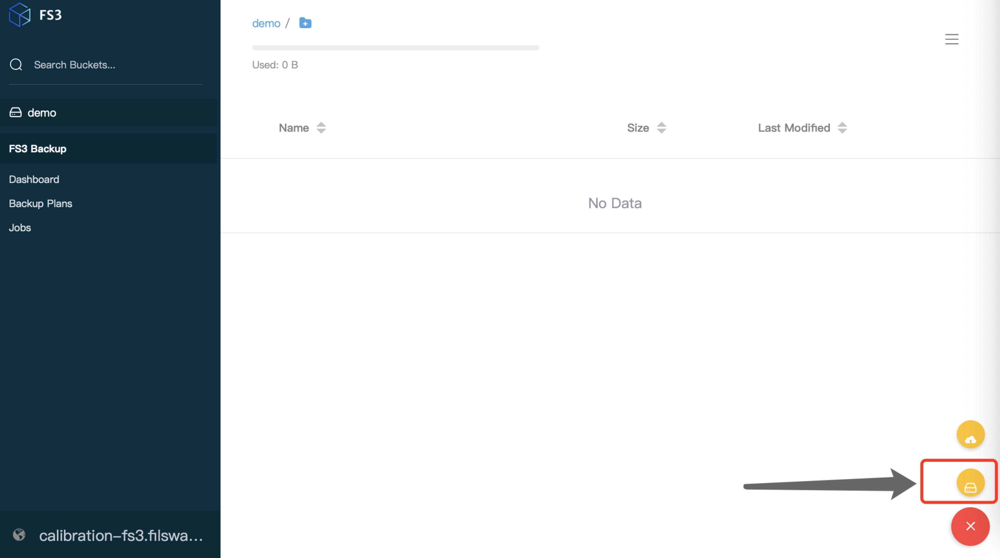

# FS3 User Guide （Cloud Version）

## Instruction

### 1. Access to FS3

<figure><figcaption></figcaption></figure>

<figure><figcaption></figcaption></figure>

### 2.  Creating a bucket

To get started, you can click the red button with a plus sign on the bottom right corner. It will pop up 2 yellow icons (upload files and create buckets) by clicking the red button. Files can not be uploaded without a bucket. The first thing is to choose the "<mark style="color:blue;">**Create buckets**</mark>" button in yellow, name it and press Enter/Return key to confirm.&#x20;

### 3. Uploading files

Within a bucket, you can upload your files by choosing the "<mark style="color:blue;">**Upload files**</mark>" button in yellow which is right above the "create bucket" button. Same as before, to appear the "upload files" button, you need to click the red button with the plus sign on it.&#x20;

### 4. Backup plan

Users can backup the entire volume with customized schedulers by choosing **Backup plan** (<mark style="color:blue;">**Backup Daily**</mark>/ <mark style="color:blue;">**Backup Weekly**</mark>) or **Snapshot backup** (<mark style="color:blue;">**Backup immediately**</mark>) to Filecoin Network.&#x20;

#### Backup plan

* Create a backup plan by choosing "<mark style="color:blue;">**Backup Plan**</mark>" page.&#x20;

<figure><figcaption></figcaption></figure>

<figure><figcaption></figcaption></figure>


**Price**: It is valued as GiB/epoch

**Duration**: Duration for keeping the backup needs to be in the range of 180 to 540.&#x20;


* You can view your created backup plans on "<mark style="color:blue;">**My Backup Plans**</mark>" page.
* As soon as the creation is complete, FS3 is sending volume backup task to the assigned storage provider automatically using FilSwan [**Autobid**](https://docs.filswan.com/filswan-platform/overview/filswan-auction-system) **** module (click Autobid to know how it works).&#x20;
* If you choose to backup daily,  FS3 will compress the entire data volume into a car. file and upload it to the Filecoin Network every 24 hours. You can check all your backup jobs by choosing "<mark style="color:blue;">**My Backup Jobs**</mark>" page, and here shows you all the information about your jobs.
* Once the backup process has completed, the status under backup jobs on the "<mark style="color:blue;">**My Backup Jobs**</mark>" page will change to "<mark style="color:green;">**Completed**</mark>".

**Snapshot backup**

* Create a backup plan by choosing "<mark style="color:blue;">**Snapshot Backup**</mark>" page.

<figure><figcaption></figcaption></figure>

<figure><figcaption></figcaption></figure>

* You can view your created backup plans on "<mark style="color:blue;">**My Snapshot Jobs**</mark>" page.
* As soon as the creation is complete, FS3 is sending volume backup task to the assigned storage provider automatically using FilSwan [**Autobid**](https://docs.filswan.com/filswan-platform/overview/filswan-auction-system) **** module (click Autobid to know how it works).&#x20;
* If you choose to backup daily,  FS3 will compress the entire data volume into a car. file and upload it to the Filecoin Network every 24 hours. You can check all your backup jobs by choosing "<mark style="color:blue;">**Backup Jobs**</mark>" page, and here shows you all the information about your jobs.
* Once the backup process has completed, the status under backup jobs on the "<mark style="color:blue;">**Backup Jobs**</mark>" page will change to "<mark style="color:green;">**Completed**</mark>".

### 6. Rebuild backup volume&#x20;


Rebuild image is accessible **only** when backup job status is **completed**. Users can not rebuild image when backup process is still running.


To store your entire FS3 instance from one of your backups, you can use the FS3 rebuild service. FS3 will fetch an entire backup from Filecoin Network and overwrite your existing system.  You can rebuild from **Backup plan** or **Snapshot backup**

****

#### **Rebuild from Backup plan**

<figure><figcaption></figcaption></figure>

* &#x20;First, go to "<mark style="color:blue;">**My Backup Jobs**</mark>" page and all your backup jobs are listed here.
* &#x20;Second, make sure you are under "<mark style="color:blue;">**Backup Jobs**</mark>" for rebuilding an image (restore a backup). You can switch to rebuild jobs below the backup jobs to view all your rebuild history.
* Third, on the very right side of each jobs, you should be able to click "<mark style="color:blue;">**Rebuild Image**</mark>" when the status is "<mark style="color:green;">**Completed**</mark>".
* Next, after clicking "<mark style="color:blue;">**Rebuild Image**</mark>", a pop up window will show as above. Please check your information and make sure you are rebuilding from the correct backup. Your backup name will show in bold font.&#x20;
* Finally, choose "<mark style="color:green;">**OK**</mark>" to confirm your rebuild process and choose "**Cancel**" to quit from rebuilding backup.&#x20;

****

**Rebuild from Snapshot backup**

<figure><figcaption></figcaption></figure>

* First, go to "<mark style="color:blue;">**Snapshot Backup**</mark>" page and all your backup jobs are listed here.
* &#x20;Second, make sure you are under "<mark style="color:blue;">**Backup Jobs**</mark>" for rebuilding an image (restore a backup). You can switch to rebuild jobs below the backup jobs to view all your rebuild history.
* Third, on the very right side of each jobs, you should be able to click "<mark style="color:blue;">**Rebuild Image**</mark>" when the status is "<mark style="color:green;">**Completed**</mark>".
* Next, after clicking "<mark style="color:blue;">**Rebuild Image**</mark>", a pop up window will show as above. Please check your information and make sure you are rebuilding from the correct backup. Your backup name will show in bold font.&#x20;
* Finally, choose "<mark style="color:green;">**OK**</mark>" to confirm your rebuild process and choose "**Cancel**" to quit from rebuilding backup.&#x20;
