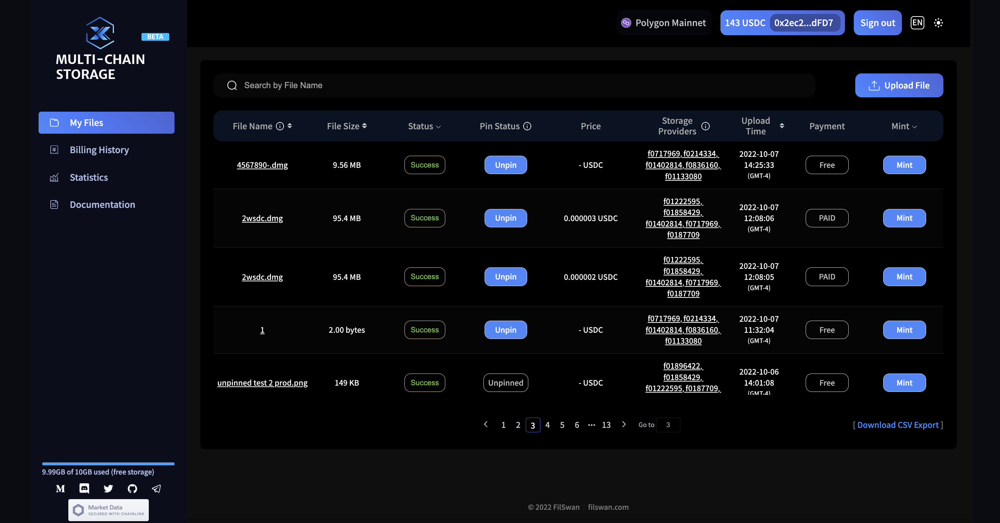
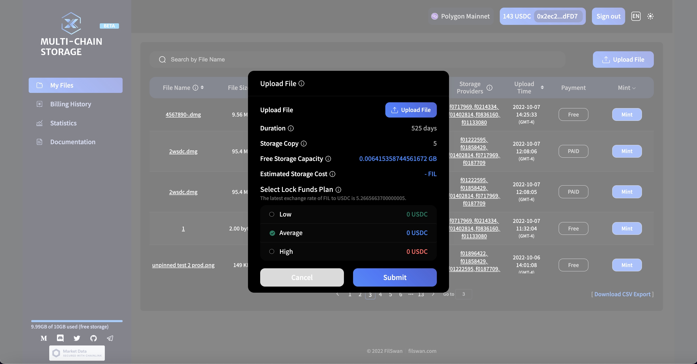
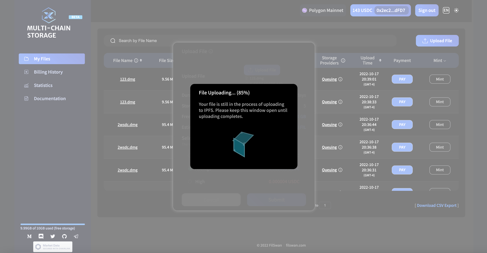
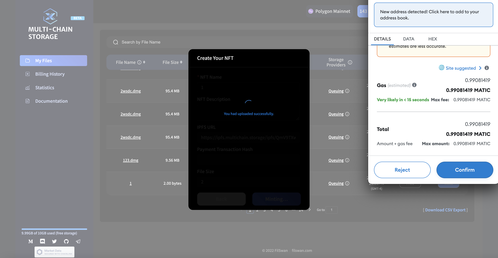

# Multichain Storage User Guide

## Requirements 

Before you begin this guide, complete the following tasks to make sure you have all of the tools that you need:

* Own a valid MetaMask wallet&#x20;
* Have USDC if you’re over the free 10GB of storage

## **Instruction**

### **1.** Connect to your MetaMask wallet, with this:

Go to MCS: [multichain.storage](https://multichain.storage/). Click on the Connect Wallet button to connect your MetaMask wallet, and make sure to select the corresponding network on the MetaMask wallet. Currently, we support Polygon Network and are soon connecting to BNB Chain, Aptos and SUI.

MCS uses both MATIC and USDC for uploading files to the Polygon network. MATIC is needed for gas fees while USDC is needed for storage fees.

<figure><figcaption></figcaption></figure>

<figure><figcaption></figcaption></figure>

### 2. Upload file **to IPFS**

* Click the button of **Upload More** .
* Choose the file you would like to backup to Filecoin Network. The file name and file size will be displayed below upload button.
* An estimated storage cost will be calculated according to the file size, the duration , and the average provider price.
* Based on the real-time DeFi exchange rate which got from Sushi Swap, three lock funds plans are provided to our users. The more funds are locked, the sooner your file will be stored on the Filecoin network. Any overpaid funds will be automatically refunded to users after the deal is on chain and contract collects enough DAO signatures.

<figure><figcaption></figcaption></figure>

<figure><figcaption></figcaption></figure>

After Submitting your request, an uploading window will show up. Uploading time varies depends on the size of your file. Please keep the window open until uploading completes.

<figure><figcaption></figcaption></figure>

### **3. Lock fund with MetaMask**

Paying for storage and locking funds only applies after using your free 10GB.

After the file has been successfully uploaded to IPFS, the next step is Lock funds to the smart contract using USDC tokens.

Waiting time varies depends on the blockchain congestion.

<figure><figcaption></figcaption></figure>

<figure><figcaption></figcaption></figure>

<figure><figcaption></figcaption></figure>

While the payment is completed, a pop-up window with the transaction link shows up. You can either click on the link or check your MetaMask activity to see the transaction at the block explorer.


**TIPS:** If you changed your mind and wanted to select another plan?

No worries, as long as you didn't confirm your payment on MetaMask. Firstly, you need to reject the transaction on MetaMask. Then, go to the 'My Files' page, you will find a PAY button to the corresponding file. By clicking the **PAY** button, you can also complete your payment.


### **4. View your files.**

By clicking the **Close** button, it will automatically turn to **My Files** page.

On this page, you can find all the files you have uploaded. It provides you some frequently used informations, such as the file name, status, data cid, provider id, and payment button, etc.&#x20;


**TIPS:** With the mouse is hovering over the provider id, it shows you the real-time deal status from blockchain.



**GOOD TO KNOW:** In order to improve the efficiency, MCS system is using FilSwan's AutoBid function. A qualified and optimal provider will be automatically assigned to your deal. The storage provider will complete following backup procedure, and synchronize the 'Deal status' to our platform.



**TIPS:** A search bar is provided on the top of file list. You can search your file by partial file name.&#x20;


To view more details, simply click on the **file name**. You can find all the related information on this page, including the IPFS download link, the retrieval from Filecoin Network command, and DAO signature information and status. You won't need to bother to check the deal with a blockchain explorer.:smile:



#### DAO Signature Process:

* When the user's deal is successfully published on blockchain, the deal will be scanned by the DAO organization.&#x20;
* Then, DAO members will sign to agree to unlock the user's funds.&#x20;
* If a specified number of signatures from DAO are collected, the smart contract will unlock the funds.&#x20;
* Part of the locked funds will be used to pay the storage fee, and the remaining will be refunded to user's wallet.


**NOTE:** An expire date is set when locking fund to smart contract, the default is 6 days. If the storage failed while the contract expired, you just need to simply hit the REFUND button, the locked fund will be refunded to users in full.&#x20;


### 5. NFT

Within MCS, you will be able to use the files you uploaded to mint NFTs if you like. The only requirement is that you have locked fund for the file to the smart contract.

To mint a NFT. You just need to click on the **MINT** button of the corresponding file. A windows will pop up with some pre-generated info, such as IPFS url, file size and lock fund transaction hash. The default NFT name will be the same as the file name, but you can always customize it, and fill in the description at will.

By clicking on the **Mint NFT** button, a MetaMask window will popup for authorization purpose. A little bit gas fee will be consumed to confirm this mint transaction.&#x20;

<figure><figcaption></figcaption></figure>

Once the mint process is completed, a View Your NFT window will popup. The transaction hash and a link to view your NFT on OpenSea are provided. You can click on the transaction has and OpenSea links to view more details.

### 6. Billing History

Users can view the billing history of all deals in 'Billing history' page. It covers all the information about the order such as the transaction hash, amount, unlock amount, token, data CID, wallet address, etc.

<figure><figcaption></figcaption></figure>
