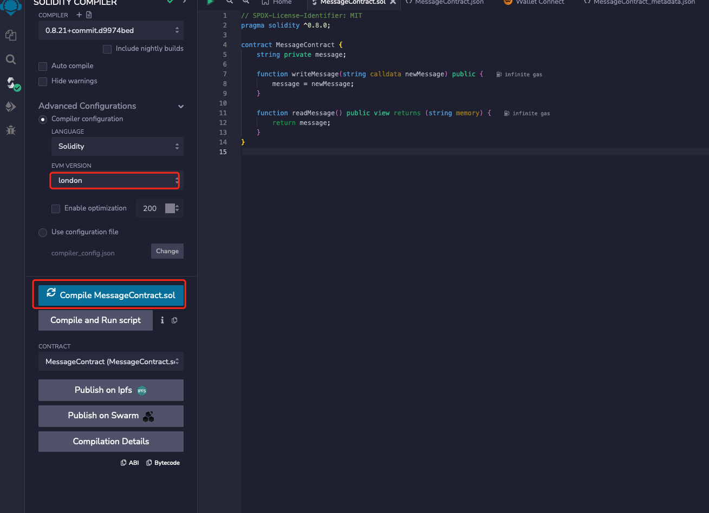

# Swan Chain: Developing Smart Contracts with Go

#### &#x20;Introduction to Swan Chain and Connecting to RPC

* Exploring Swan Chain: An Overview of Its Blockchain Features
* Setting up the Go Development Environment for Swan Chain
* Connecting to a Swan Chain RPC Using Go
* Fetching Basic Blockchain Data from Swan Chain

Setup your RPC URL

<pre><code>package main
// Shared RPC URL
<strong>const rpcURL = "https://rpc-testnet.swanchain.io" // Replace with your testnet's RPC URL
</strong></code></pre>

```
func TestConnectToTestnet(t *testing.T) {
	ctx, cancel := context.WithTimeout(context.Background(), 3*time.Second)
	defer cancel()

	// Assuming rpcURL is defined as a constant or variable that contains your Ethereum testnet RPC URL
	client, err := ethclient.DialContext(ctx, rpcURL)
	if err != nil {
		t.Fatalf("Failed to connect to the testnet: %v", err)
	}
	defer client.Close()

	// Fetching the network ID
	networkID, err := client.NetworkID(ctx)
	if err != nil {
		t.Fatalf("Failed to get network ID: %v", err)
	}

	// Fetching the latest block number
	blockNumber, err := client.BlockNumber(ctx)
	if err != nil {
		t.Fatalf("Failed to get the latest block number: %v", err)
	}

	t.Logf("Network ID: %v", networkID)
	t.Logf("Latest block number: %d", blockNumber)
}
```

Output

> \=== RUN TestGetAccountBalance ethclient\_test.go:64: Balance of account \[0xA41c36BCd65bDbFB62FE93E3b7a28d290E63C1F7]: 0.045930 Ether
>
> &#x20;\--- PASS: TestGetAccountBalance (0.21s)&#x20;

#### &#x20;Managing Wallets and Checking Balances

* Creating and Managing Swan Chain Wallets with Go
* Understanding and Checking Wallet Balances on Swan Chain
* Handling Swan Chain's Native Cryptocurrency Units

```
// TestGetAccountBalance tests fetching the balance for a specific account
func TestGetAccountBalance(t *testing.T) {
   accountAddress := "0xA41c36BCd65bDbFB62FE93E3b7a28d290E63C1F7" // Replace with the account address

   ctx, cancel := context.WithTimeout(context.Background(), 3*time.Second)
   defer cancel()

   client, err := ethclient.DialContext(ctx, rpcURL)
   if err != nil {
      t.Fatalf("Failed to connect to the testnet: %v", err)
   }
   defer client.Close()

   address := common.HexToAddress(accountAddress)
   balanceWei, err := client.BalanceAt(ctx, address, nil) // Balance in Wei
   if err != nil {
      t.Fatalf("Failed to get the account balance: %v", err)
   }

   // Convert balance from Wei (big.Int) to Ether (float64)
   balanceEther := new(big.Float).Quo(new(big.Float).SetInt(balanceWei), big.NewFloat(math.Pow10(18)))

   t.Logf("Balance of account [%s]: %f Ether", accountAddress, balanceEther)

}
```

#### Deploying a Smart Contract

* Install and fund your MetaMask wallet
* Write, compile, and deploy your first smart contract

```
// SPDX-License-Identifier: MIT
pragma solidity ^0.8.0;

contract MessageContract {
    string private message;

    function writeMessage(string calldata newMessage) public {
        message = newMessage;
    }

    function readMessage() public view returns (string memory) {
        return message;
    }
}
```

* Click "Advanced Configurations" , and choose "London"

<figure><figcaption></figcaption></figure>

* Click .png>) and choose "WalletConnect" to deploy&#x20;

<figure><figcaption></figcaption></figure>



#### Writing and Reading from a Smart Contract

* Setting up Go for Smart Contract Interaction
* Writing Data to a Smart Contract on Swan Chain
* Reading and Interpreting Data from a Smart Contra


Source code can be found here:


