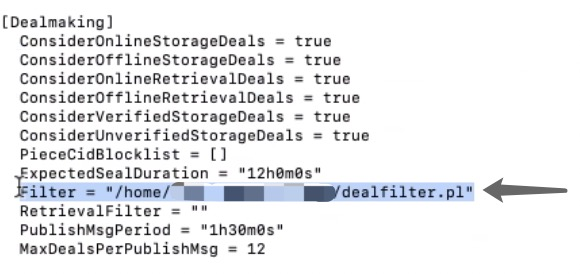
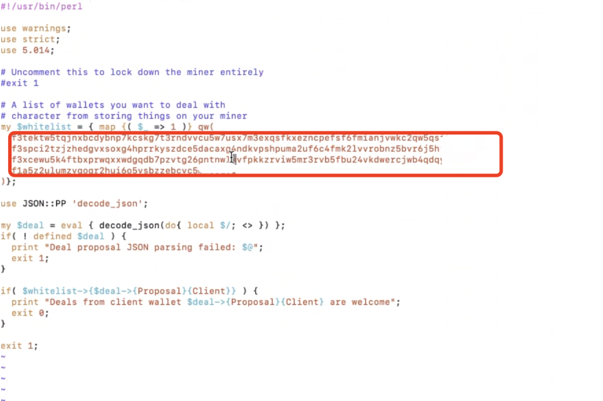

# Swan Provider支持

### 1. 如果您在接单过程中总出现拒绝信息

#### 1.1 查看是否过滤器设置有误

如果用户设置过滤器有误，则会导致订单被过滤出去，在接单过程中出现拒绝消息。过滤器的设置包括设置白名单以及设置黑名单。 白名单是设置能接受订单的地址，白名单以外的地址都不可以接受订单。黑名单是设置不能接受订单的地址地址，黑名单以外的用户都可以接受订单。所以一般情况下白名单比黑名单限制的用户要更多一些。因此，如果地址设置了白名单，用户可以接受白名单上的地址的订单，其他的订单都会被过滤出去。&#x20;

首先，可以通过以下命令行查看订单是否被拒绝

```
lotus-miner stroage-deals list -v| grep deal_cid
```

如果订单被拒绝，可以通过如下图所示，在存储提供商Miner的config文件里，\[**Dealmaking**]下则可以查看接单的filter是否设置错误



下图是设置黑名单的过滤器的展示: 红色圈出来的地址为黑名单地址，不接受此地址的订单


下图是设置白名单的过滤器的展示: 红色圈出来的地址为白名单地址，只接受此地址的订单


