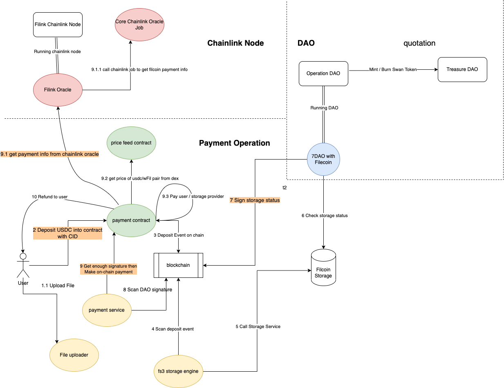

# Filecoin Deal Sender

## 1. Filecoin Deal Sender

As a PiB-level data onboarding tool for Filecoin Network, Swan-client can help users prepare data and send the data to storage providers in the Filecoin network. The main features and steps are as follows:

* Generate CAR files from your source files by graphsplit, lotus, IPFS, or ipfs-car.
* Upload the CAR files to the IPFS server and generate metadata files (JSON and CSV) for sending offline deals.
* Propose offline deals based on the metadata file.
* Generate a final metadata file for storage providers to import deals.
*   Create tasks and offline deals on [Swan Platform](https://console.filswan.com/#/dashboard).

    **(Storage Providers can automatically import the deals by** [**Swan-Provider**](https://github.com/filswan/go-swan-provider/tree/release-2.1.0-rc1)**)**

swan-client can help users send their data to storage providers by creating three different kinds of tasks. The complete process from the source file to the storage provider is as follows:

<figure><figcaption></figcaption></figure>


[installation.md](installation.md)



[configuration.md](configuration.md)



[prerequisites.md](prerequisites.md)



[generate-car-files.md](generate-car-files.md)



[upload-car-files-to-ipfs.md](upload-car-files-to-ipfs.md)



[create-a-task.md](create-a-task.md)

