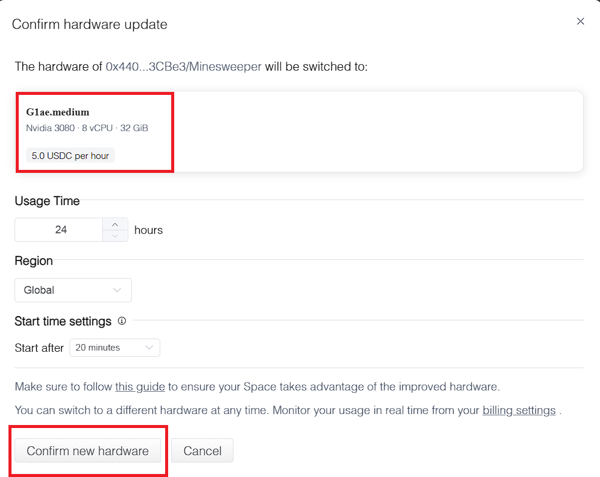
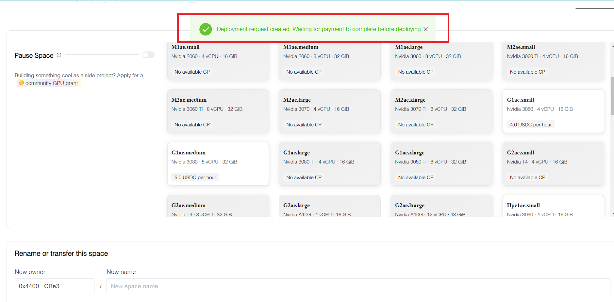

# Network Early Adopter

## **Introduction**

Embark on an exciting journey to become a Network Early Adopter and play a crucial role in shaping the future of decentralized cloud computing. Join the Swan Testnet campaign and test the limits of our network, no matter your background or technical expertise

As a **Network Early Adopter**, you'll gain valuable insights into the capabilities of our decentralized cloud computing platform and contribute to its growth. You'll have the freedom to fork existing Spaces or create your own, unleashing your creativity and exploring the vast possibilities of Lagrange.

_**IMPORTANT:**_ _Before proceeding with Fork, please thoroughly review the_ [_"Acquire Testnet USDC Tokens Tutorial"_](https://docs.filswan.com/swan-testnet/swan-jupiter-testnet/before-you-get-started) _and ensure you are using Swan-USDC for testing purposes._

## How to Fork Space

**Step 1:** Visit [\[https://lagrangedao.org/spaces\]](https://lagrangedao.org/spaces) and log in to your account

<figure><figcaption></figcaption></figure>

**Step 2:** Visit the [Minesweeper Space](https://lagrangedao.org/spaces/0xC9180616B2b797385Ad64d09BF8730D74E3b5a41/Minesweeper/app) and click on the \[Fork] button to create a duplicate of the Minesweeper Space.

<figure><figcaption></figcaption></figure>

**Step 3:** You can either click on the \[Just Fork, choose config later] or select your preferred hardware as long as it's **not** **the** **Free tier** since we are looking to test out the payment feature of our testnet, and proceed with the payment.

_It's recommended to choose "config later" if you anticipate adding more models to your Space in the future to avoid unnecessary redeployments._

<figure><figcaption></figcaption></figure>

**Step 4:** After successfully duplicating your Space, click the \[Settings] button and scroll down to the Rename section to rename your Space. Moreover, you can choose a hardware for your Space if you click \[Just Fork, choose config later] in previous step \[3]

<figure><figcaption></figcaption></figure>

_**Note:** Please note that after you change the Space name, the Space link will also be updated. Make sure to share the new link with others as needed._

<figure><figcaption></figcaption></figure>

**Step 5:** Review the hardware options and select the most suitable one. Click \[Confirm new hardware].

<figure><figcaption></figcaption></figure>

**Step 6:** Connect to your MetaMask wallet. Then set the spending cap request to 1500 (MAX). Click \[Next] to continue.

<figure><figcaption></figcaption></figure>

**Step 7:** You will need a small amount of SWAN-ETH gas to proceed. Click the \[Approve] button to complete the transaction.

<figure><figcaption></figcaption></figure>

**Step 8:** Click on your avatar profile icon in the upper right corner after your payment has been successfully processed.

<figure><figcaption></figcaption></figure>

**Step 9:** Your Minesweeper Spaces will be there.&#x20;

<figure><figcaption></figcaption></figure>

**Step 10:** Click on Space and you can check the Deployment Machine as well.

<figure><figcaption></figcaption></figure>

